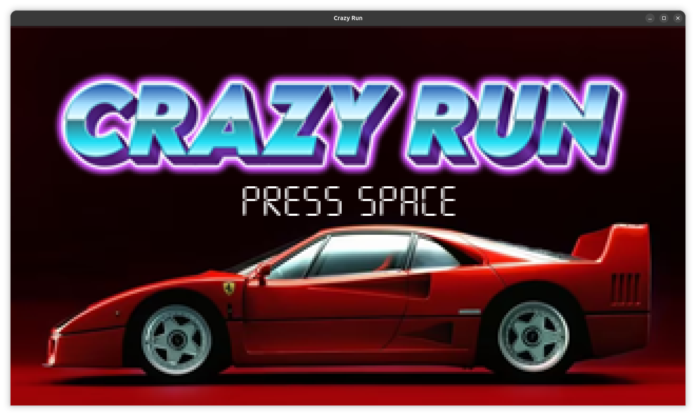
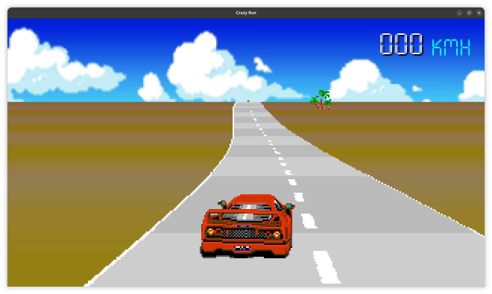

CrazyRun
========

Overview
--------

CrazyRun is a small Python game inspired by Cray Cars. It borrows the fast-paced arcade feel and vehicle-based action of Cray Cars while using original assets and gameplay mechanics.




Features
- Fast arcade driving and obstacles
- Simple keyboard controls
- Uses assets in the `assets/`, `fonts/`, and `sounds/` folders

Installation
------------

1. Create a Python virtual environment (recommended).

Linux / macOS:

```bash
python3 -m venv venv
source venv/bin/activate
pip install -r requirements.txt
```

Windows (PowerShell):

```powershell
python -m venv venv
venv\Scripts\Activate.ps1
pip install -r requirements.txt
```

If you don't have a `requirements.txt`, install the main dependency manually (typically `pygame`):

```bash
pip install pygame
```

Running the game
----------------

After installing dependencies, run the game using one of the provided launch scripts or directly with Python.

Linux / macOS:

```bash
./run.sh
# or
python3 main.py
```

Windows:

```powershell
.\run.bat
# or
python main.py
```

Notes
-----

- The game uses the `assets/`, `fonts/`, and `sounds/` directories for media. Keep these folders alongside `main.py`.
- This project is an independent work inspired by Cray Cars and does not copy any original game assets.
